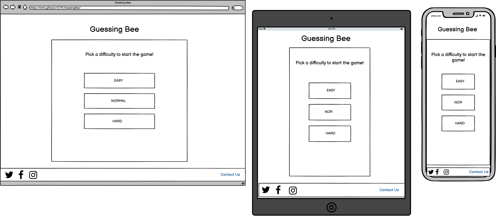
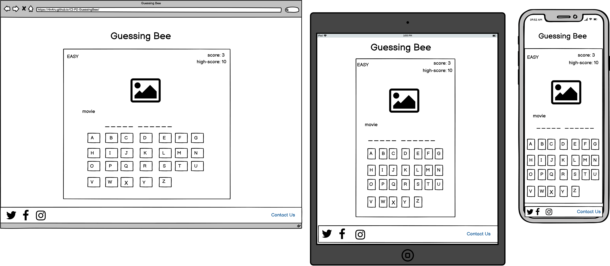
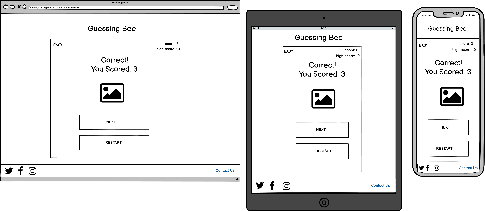
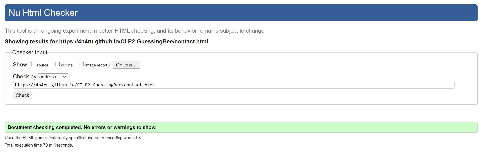
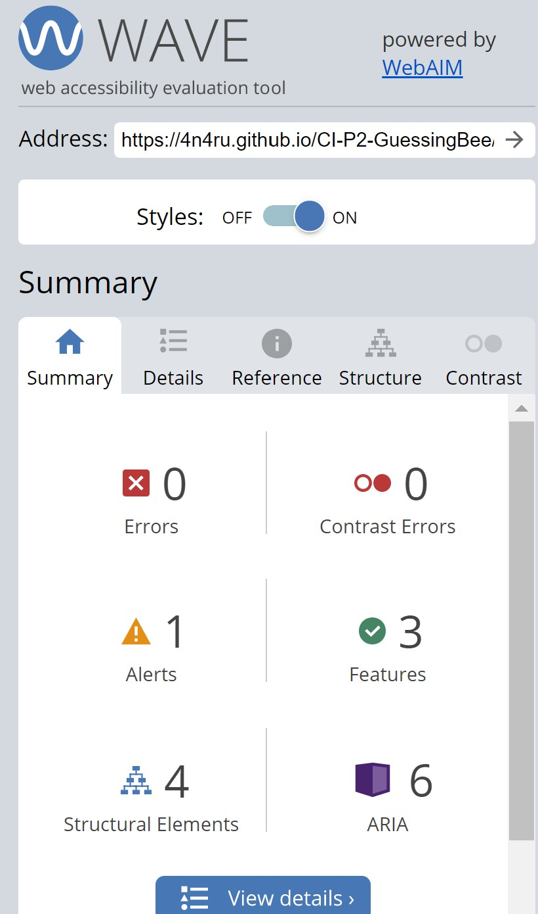

# Guessing Bee
(Developer: Ana Runje)

[Live webpage](https://4n4ru.github.io/CI-P2-GuessingBee/)

## Table of Content

1. [Project Goals](#project-goals)
    1. [User Goals](#user-goals)
    2. [Site Owner Goals](#site-owner-goals)
2. [User Experience](#user-experience)
    1. [Target Audience](#target-audience)
    2. [User Requrements and Expectations](#user-requrements-and-expectations)
    3. [User Stories](#user-stories)
3. [Design](#design)
    1. [Design Choices](#design-choices)
    2. [Colour](#colours)
    3. [Fonts](#fonts)
    4. [Structure](#structure)
    5. [Wireframes](#wireframes)
4. [Technologies Used](#technologies-used)
    1. [Languages](#languages)
    2. [Frameworks & Tools](#frameworks-&-tools)
5. [Features](#features)
6. [Testing](#validation)
    1. [HTML Validation](#HTML-validation)
    2. [CSS Validation](#CSS-validation)
    3. [JavaScript Validation](#javascript-validation)
    4. [Accessibility](#accessibility)
    5. [Performance](#performance)
    6. [Device testing](#performing-tests-on-various-devices)
    7. [Browser compatibility](#browser-compatability)
    8. [Testing user stories](#testing-user-stories)
8. [Bugs](#Bugs)
9. [Deployment](#deployment)
10. [Credits](#credits)
11. [Acknowledgements](#acknowledgements)

## Project Goals 
Guessing bee is a clasic Hangman game with a twist. Instead of hanging the clasic stickfigure, it's time to rescue some flowers so the bees can be happy!

### User Goals
- Play a fun and engaging word guessing game
- Test your general knowledge by guessing different phrases 

### Site Owner Goals
- Creating a fun and engaging game that users will want to play again and again.
- The game should be fully responsive to be able to be played on different devices.

## User Experience

### Target Audience
- casual gamers
- people who like word games
- people looking for a quick and easy yet engaging game 

### User Requrements and Expectations

### User Stories
1. As a user, I want to be able to pick a difficulty for the game
2. As a user, I want to test my general knowledge by guessing different phrases
3. As a user, I want to to be able to pick the letters both by clicking the mouse and by using the keyboard
4. As a user, I want to know what the correct phrase was in case I don't guess it correctly
5. As a user, I want feedback on my correct answers
6. As a site owner, I want for the user to be able to share the game with friends
7. As a site owner, I want for users to be able to make suggestions for new phrases.
8. As a site owner, I want users to have the option to play the game on multiple different devices. 

## Design

### Design Choices
The game was designed to have a calming and relaxing effect on the user. Instead of the classic stickfigure being hanged, the game uses flowers that lose petals. By doing so the negative connotation of the game being morbid or offensive is removed.

### Colour
The color palete was chosen to match the flowery theme of the background image. A color picker was used to pick colors from the background image, these colors where then further ajusted to meet accesibility criteria. 

### Fonts
For the fonts, Bootstrap's Native font stack was used. The phrase that is to be guessed monospace is used to avoid the words jumping form one line to the next and back depending on the guessed letter. 

### Structure
The page is structured in a user friendly and easy to learn way. Upon arriving to the website the user sees a screen with the option to choose a difficulty for the game. The website consists of three separate pages:

- A homepage with 4 different views:
    - one for selecting a dificulty
    - one for playing the game
    - one that is shown after a correct guess
    - one that is shown after the user runs out of moves
- A contact form
- A 404 page

### Wireframes

Start

Game

Next

Game Over

## Technologies Used

### Languages
- HTML
- CSS
- JavaScript

### Frameworks & Tools
- Bootstrap v5.0
- Git
- GitHub
- Gitpod
- Tinypng
- Paint.NET
- Balsamiq
- Font Awsome
- Favicon.io
- JSHint
- Lighthouse
- W3C Markup validation service
- W3C Jigsaw CSS validation service 
- WAVE WebAIM web accessibility evaluation tool
- EmailJS

## Features
The site consists of three pages and nine features

### Header
- Featured on all pages
- Consists of the game logo and game title

### Footer
- Featured on all pages
- Consists of a section providing social media links and a link to the contact form

### Start screen
- Provides a option to choose between three diferent game dificulties.

### Game screen
- Consists of 6 different sections:
    - Game dificulty that is currently being played
    - A section with the current score and the h-score
    - An image that shows how many moves are left in the game round
    - The theme of the curent phrase to be guessed
    - The phrase to be guessed represented with underscores that switch to letters after each correct guess
    - Alphabet buttons

### Game over screen
- Consists of three sections
    - A section with the current score and the h-score
    - The game over message with a picture of a sad bee
    - Buttons to chose what to do next

### Correct guess screen
- Consists of four sections
    - Game dificulty that is currently being played
    - A section with the current score and the h-score
    - The congratulary message with a picture of a happy bee
    - Buttons to chose what to do next

### Contact form
- A way for user to provide feedback

### Form confirmation
- Provieds the user with feedback after the form has been submited and a button to return to the game

### 404 message
- Provides the user with a way to return to the game after clicking on a broken link

## Validation

### HTML Validation
The W3C Markup Validation Service was used to validate the HTML of the website. All pages pass with no errors no warnings to show.

Home

Contact Us

404

### CSS Validation
The W3C Jigsaw CSS Validation Service was used to validate the CSS of the website. When validating the page as a whole, the validator shows some errors linked to Bootstrap v5.0. When validating just my own custom CSS it passes with no errors.

Full page

style.css

### JavaScript Validation
JSHint Static Code Analysis Tool for JavaScript was used to validate the Javascript files. No significant issues were found.

game-settings.js

guessing-be.js

contact.js

### Accessibility
The WAVE WebAIM web accessibility evaluation tool was used to ensure the website met high accessibility standards. All pages pass with 0 errors.

Home

Contact

404

### Performance 

### Performing tests on various devices 

### Browser compatability

### Testing user stories

1. 

| **Feature** | **Action** | **Expected Result** | **Actual Result** |
|-------------|------------|---------------------|-------------------|

Screenshots

## Bugs

| **Bug** | **Fix** |
| ----------- | ----------- |
|  |  |
- not working for uppercase letters

## Deployment
The website was deployed using GitHub Pages by following these steps:
1. In the GitHub repository navigate to the Settings tab
2. On the left hand menu select Pages
3. For the source select Branch: master
4. After the webpage refreshes automaticaly you will se a ribbon on the top saying: "Your site is published at https://4n4ru.github.io/CI_MS1_BodelschwingherHof/"

You can for fork the repository by following these steps:
1. Go to the GitHub repository
2. Click on Fork button in upper right hand corner

You can clone the repository by following these steps:
1. Go to the GitHub repository 
2. Locate the Code button above the list of files and click it 
3. Select if you prefere to clone using HTTPS, SSH, or Github CLI and click the copy button to copy the URL to your clipboard
4. Open Git Bash
5. Change the current working directory to the one where you want the cloned directory
6. Type git clone and paste the URL from the clipboard ($ git clone https://github.com/YOUR-USERNAME/YOUR-REPOSITORY)
7.Press Enter to create your local clone.

## Credits
All images, save the background image were created by the developer.

### Media
In order of apearance:
- [background image]('assets/images/background.jpg'): <a href='https://www.freepik.com/free-photos-vectors/floral'>Floral vector created by macrovector_official - www.freepik.com</a>

### Code
- CSS for background image opacity https://css-tricks.com/snippets/css/transparent-background-images/
- HTML for the modals https://getbootstrap.com/docs/5.0/components/modal/#live-demo

## Acknowledgements
I would like to take the opportunity to thank:
- My mentor Mo Shami for his feedback, advice, guidance and support.
- My husband Jure Runje for his support, advice, help with testing, and for giving me some kids free time to work on my project.
